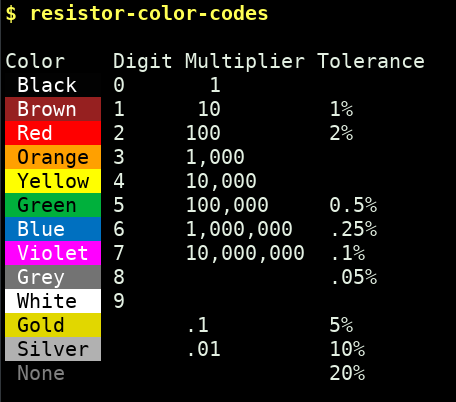
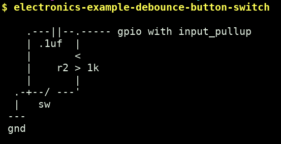
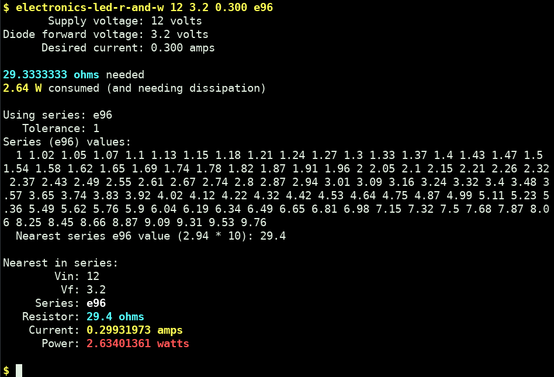

# electronics-handy-cli

Electronics references and utilities; maybe handy for some.

By jaggz.h who is at gmail

# Examples:

* resistor-color-codes

* electronics-example-debounce-button-switch

* electronics-led-r-and-w

# Installation / Requirements

1. Perl needs to be installed for some utils
1. With Perl, some use Text::Table, or other perl module dependencies you may need to install (on Debian based systems, eg., `apt install libtext-table-perl` or `cpanm Text::Table` or ...)
1. I check out the repository, then symlink the utils I want into my ~/bin/ folder (ie. `cd ~/bin && ln -s ~/local/src/electronics-handy-cli/resistor-color-codes` etc.)
